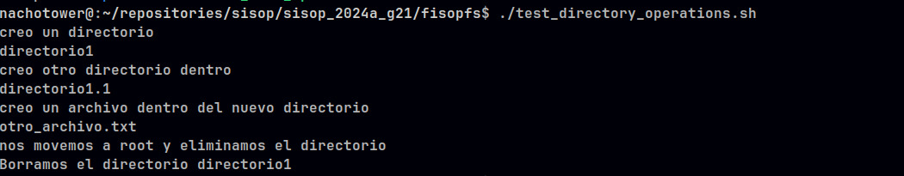
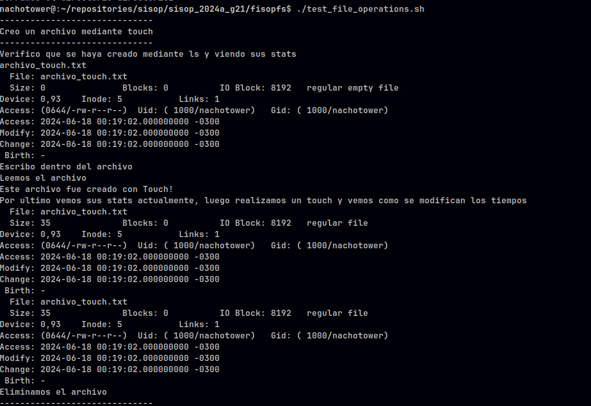
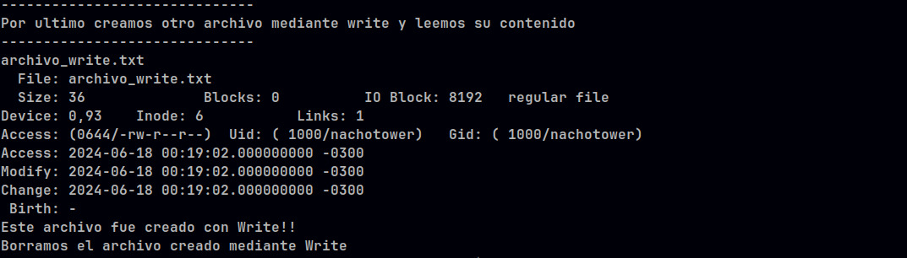
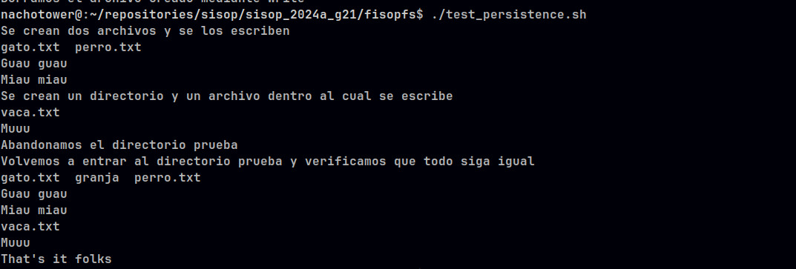

# fisop-fs

## Documentación de diseño

# Estructuras

El filesystem implementado consta de 3 estructuras principales:
 - 1 Superbloque.
 - 1 Bitmap de inodos.
 - 80 Inodos.

# Superbloque
El superbloque contiene metadata de todo el filesystem, la cual es, la cantidad total de inodos presentes en el mismo y un puntero al comienzo de bitmap de inodos.

# Bitmap de inodos
El bitmap de inodos es una estructura que mapea cada inodo e indica si estan ocupados o libres mediante 1's y 0's, donde 1 es ocupado y 0 es libre. 
El mismo se implementa mediante un arreglo y se utiliza para saber que inodos estan disponibles, para ser usados, dentro del arreglo de inodos.

# Inodos
Los inodos son estructuras que contienen tanto la data como la metadata de un archivo, para una mayor simplicidad se guarda la data dentro del propio inodo, en lugar de utilizar datablocks, estos se encuentran almacenados en un arreglo de inodos, donde cada posicion del mismo es referenciada por el bitmap de inodos.
Los campos que componen al inodo son los siguientes:
- inum          -> Posicion del inodo dentro del arreglo (numero de inodo).
- tipo          -> Tipo de inodo, si es un archivo o directorio.
- nombre        -> Nombre del inodo, incluyendo ruta completa.
- modo          -> Si el archivo puede ser leido/ escrito/ ejecutado.
- dueño         -> User id del creador del archivo.
- grupo         -> Group id.
- tamaño        -> Tamaño del archivo, cuanto esta en uso realmente.
- ctime         -> Hora en la que fue creado.
- mtime         -> Hora en la que fue modificado.
- atime         -> Hora en la que se accedio por ultima vez.
- links_count   -> Cantidad de hard links.
- data          -> Data del inodo.


## Como se encuentra un archivo especifico a partir de un path.

Para encontrar un archivo mediante un path contamos con la siguiente funcion auxiliar:

```c
int get_inode(const char *path)
```

El algoritmo es muy simple, primero recorre el bitmap de inodos, para cada posicion se fija si esta ocupado o no. 
Si esta ocupado, busca el inodo dentro del arreglo de inodos y compara su nombre con el path pasado por parametro, de coincidir, devuelve la posicion del mismo.


## Estructuras auxiliares.

A parte de todas las estructuras mencionadas al inicio, no se utilizo ningun otro tipo de estructura.


## Serializacion en disco.

Para la persistencia se escriben los bytes del estado actual de las estructuras dentro de un archivo. 
Cuando se vuelve a inicializar el filesystem se lee del archivo y se setean todas las estructuras en base a lo que se leyo del archivo, de no existir el archivo, lo crea para iniciar la serializacion.


## Informacion relevante.

El tamaño de un archivo es fijo (8 Kb), a diferencia de un sistema que utiliza punteros a bloques que puede agrandar o disminuir su capacidad.


## Test.







