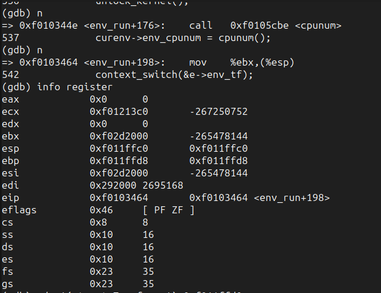
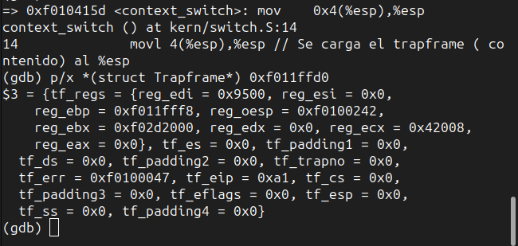
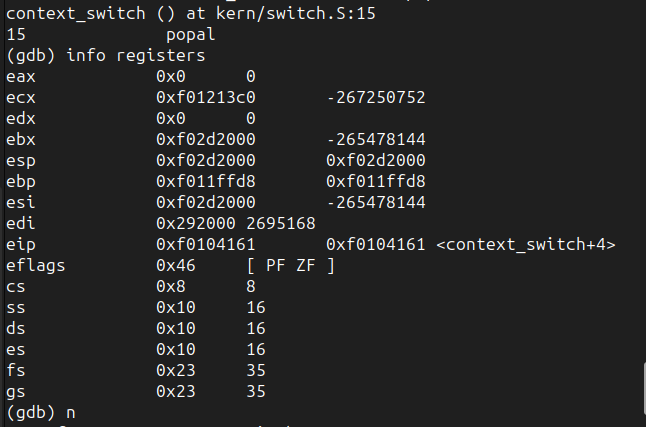
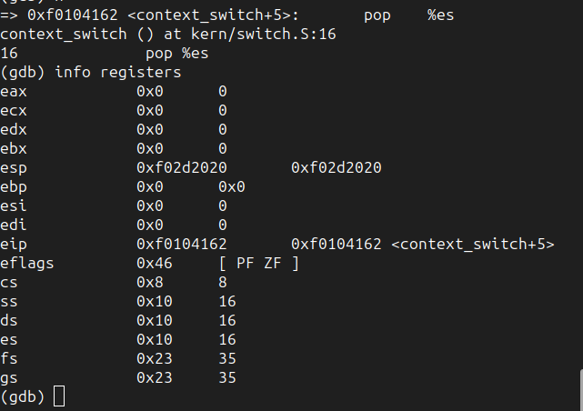
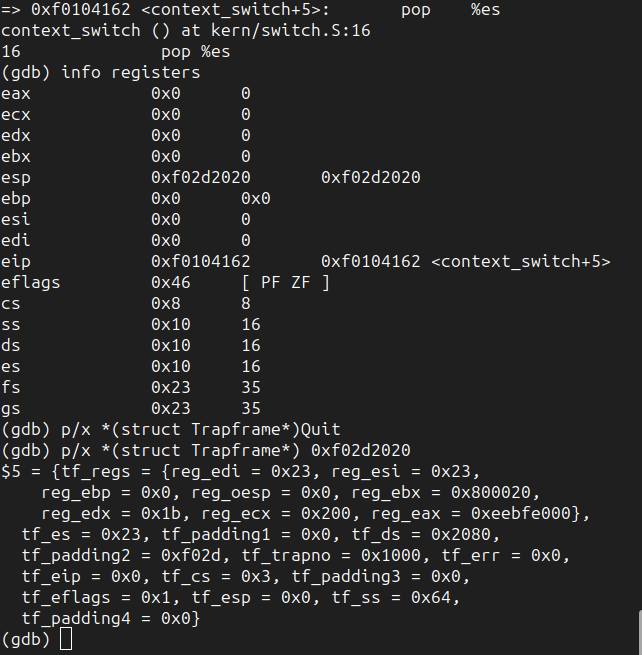
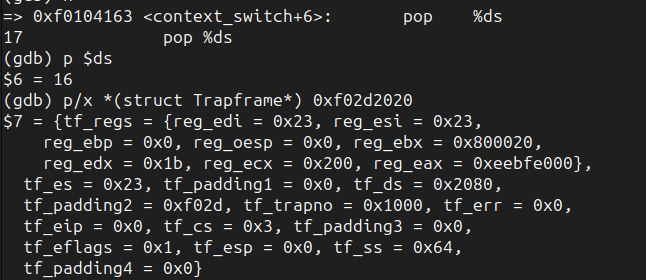

# sched

## Parte 1 

### Imagenes con la info solicitada 

#### Registros pre context switch

#### Trapframe pre context switch 

#### Registros pre popal 

#### Registros post popal

#### Stack post popal

#### Stack post pop %esp 

## Parte 2

## Parte 3