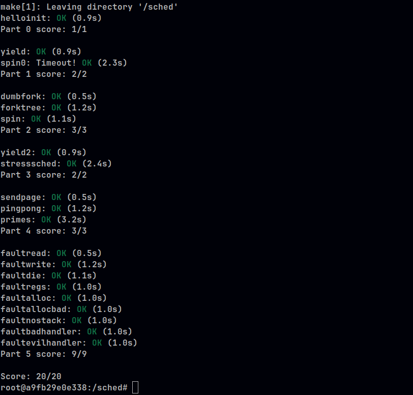

# sched

## Parte 1 

### Imagenes con la info solicitada 

#### Registros antes del context switch

#### Trapframe antes del context switch 

#### Registros previamente a la ejecucion de la instruccion popal 

#### Registros posteriormente a la ejecucion de la instruccion popal

#### Stack posteriormente a la ejecucion de la instruccion popal

#### Stack posteriormente a la ejecucion de la instruccion pop %esp 

#### Trapframe previamente a la ejecucion de la instruccion intruccion iret 

#### Registros previamente a la ejecucion de la instruccion iret   

####  Registros posteriormente a la ejecucion de instruccion la iret 

## Parte 2

Se completo correctamente la implementacion de un scheduler aplicacion la estrategia round robin 

####  Ejecucion de las pruebas automaticas del scheduler RR 

## Parte 3

Para la parte 3 se implemento un lottery scheduler. 

### Lottery Scheduler

Un scheduler de lotería es una implementación de un scheduler basado en el proportional share. Es una idea muy antigua y básica que, cada vez que se quiere realizar la ejecución de un proceso, lleva a cabo un sorteo entre todos los procesos posibles a ejecutar y de manera oportunista escoge dicho proceso a ejecutar.

Se utiliza el concepto de ticket. A cada proceso, al inicio, se le asigna una cantidad n de tickets que representan su porción del recurso a utilizar, en este caso, la CPU.

El uso de la aleatoriedad es lo que favorece la equidad (fairness) de este scheduler. Para esta implementación del scheduler, se utiliza un generador semi-aleatorio de números muy básico para la elección del número del ticket ganador.

#### Sobre esta implementacion

1. Se asume que todos los procesos tienen igual importancia y se les asigna a cada uno una proporción idéntica para poder acceder al procesador. En este caso, se les asignan 100 mil tickets a cada proceso al inicio.

2. Cuando un proceso es ejecutado, hace uso de una parte de su recurso y, por lo tanto, se le resta `1` ticket por cada ejecución.

3. Se obtiene el número total de tickets de todos los procesos en estado `runnable`.

4. Usamos el generador de números semi-aleatorio para generar el número del ticket ganador.

5. Hallamos a todos los candidatos a ganadores contando los tickets de todos los procesos y sumándolos, registrando a todos los procesos que tengan más tickets que el contador hasta ese punto.

6. Utilizando el generador de números semi-aleatorio, decidimos un ganador entre los posibles ganadores y lo enviamos a ejecutar, restándole un ticket.

7. Si no hay tickets disponibles, entonces se revisa si el proceso actual está en estado `running` y si aún tiene tickets para ser ejecutado.

#### Documentacion utilizada

Para construir este scheduler se usa de referencia la bibliografia de la catedra:

- [ARP](http://ostep.org) Scheduling: Proportional share. CAP9

#### Ejecucion de pruebas con automaticas del scheduler lottery 

