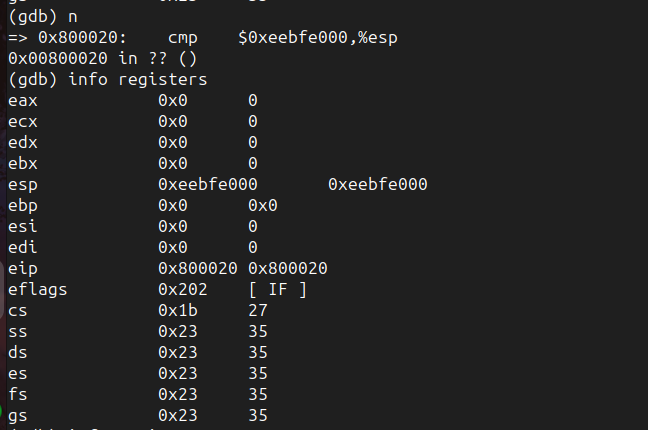

# sched

## Parte 1 

### Imagenes con la info solicitada 

#### Registros antes del context switch

#### Trapframe antes del context switch 

#### Registros previamente a la ejecucion de la instruccion popal 

#### Registros posteriormente a la ejecucion de la instruccion popal

#### Stack posteriormente a la ejecucion de la instruccion popal

#### Stack posteriormente a la ejecucion de la instruccion pop %esp 

#### Trapframe previamente a la ejecucion de la instruccion intruccion iret 

#### Registros previamente a la ejecucion de la instruccion iret   

####  Registros posteriormente a la ejecucion de instruccion la iret 

## Parte 2

Se completo correctamente la implementacion de un scheduler aplicacion la estrategia round robin 

####  Ejecucion de las pruebas automaticas del scheduler RR 

## Parte 3

