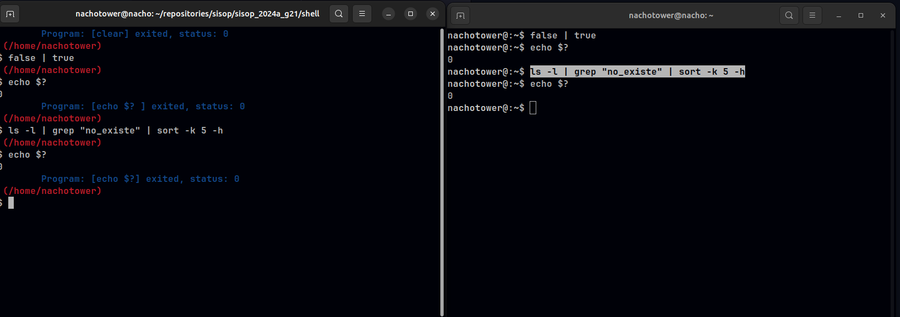

# shell

### Búsqueda en $PATH

#### ¿Cuáles son las diferencias entre la syscall execve(2) y la familia de wrappers proporcionados por la librería estándar de C (libc) exec(3)?

Cómo aceptan los argumentos: La familia de exec roporciona múltiples funciones con diferentes firmas, algunas toman una lista de argumentos separados por coma, otras toman un vector de argumentos, y algunas incluso permiten especificar variables de entorno.

Cómo manejan los errores: En resumen, mientras que execve(2) ofrece un mayor nivel de control sobre la detección de errores, ya que el programador puede examinar directamente el valor de retorno y errno, las funciones exec(3) simplifican esto al devolver solo -1 en caso de error y establecer errno en consecuencia.

Entorno del nuevo proceso a ejecutar: El "entorno" se refiere a las variables de entorno del proceso, que son pares de clave-valor que contienen información relevante para el entorno de ejecución del programa. Algunos ejemplos comunes de variables de entorno incluyen PATH, HOME, USER, entre otras.
Con execve(2), tenemos un control completo sobre los argumentos y el entorno del nuevo programa que se va a ejecutar. Esto nos permite proporcionar argumentos y un entorno personalizados según las necesidades de la aplicación.
El entorno para estas funciones (funciones exec(3)) es el mismo que el del proceso que las llama. No podemos modificar el entorno directamente antes de invocar una de estas funciones.

#### ¿Puede la llamada a exec(3) fallar? ¿Cómo se comporta la implementación de la shell en ese caso?

Sí, la llamada a exec(3) puede fallar por varias razones, como por ejemplo si el archivo ejecutable especificado no existe, si no tiene permisos de ejecución, si el número máximo de archivos abiertos se ha alcanzado, etc.
Cuando exec(3) falla, generalmente devuelve -1 y establece la variable errno para indicar el tipo de error que ocurrió.
En el caso de una shell, si la llamada a exec(3) falla, la shell normalmente imprimirá un mensaje de error apropiado, como "comando no encontrado" o "permiso denegado", y luego continuará esperando la próxima entrada del usuario. Esto permite que la shell siga siendo interactiva y útil, incluso si algunos comandos no se pueden ejecutar correctamente.

---

### Procesos en segundo plano

#### Detallar cuál es el mecanismo utilizado para implementar procesos en segundo plano

Para implementar procesos en segundo plano en una shell, generalmente se siguen estos pasos:

1. Leer el comando del usuario: La shell lee el comando ingresado por el usuario, ya sea desde la línea de comandos o desde un script.
2. Verificar si el comando debe ejecutarse en segundo plano: La shell verifica si el comando termina con el símbolo '&' al final. Si lo hace, significa que el usuario quiere que el comando se ejecute en segundo plano.
3. Crear un proceso hijo: La shell crea un proceso hijo utilizando la syscall fork(). Este proceso hijo ejecutará el comando ingresado por el usuario.
4. Configurar la señal SIGCHLD: La shell configura un manejador de señales para la señal SIGCHLD, que se envía cuando un proceso hijo termina. Este manejador de señales se encargará de limpiar los procesos hijos que hayan terminado.
5. Ejecutar el comando: En el proceso hijo, la shell utiliza una de las variantes de exec() (por ejemplo, execvp()) para reemplazar la imagen del proceso hijo con el comando ingresado por el usuario.
6. Continuar la ejecución: En el proceso padre, la shell puede esperar a que el proceso hijo termine antes de continuar su ejecución, o puede continuar inmediatamente sin esperar, dependiendo de si el comando se ejecuta en segundo plano o no.
7. Informar al usuario: Si el comando se ejecuta en segundo plano, la shell puede imprimir un mensaje indicando el PID del proceso hijo para que el usuario pueda monitorearlo si es necesario.
8. Volver al paso 1: La shell vuelve a esperar el próximo comando del usuario.

Este mecanismo permite que la shell ejecute comandos tanto en primer plano como en segundo plano, lo que la hace más flexible y versátil para el usuario.

---

### Flujo estándar

#### Investigar el significado de 2>&1, explicar cómo funciona su forma general

El comando de redireccion 2>&1 se utiliza para redireccionar el flujo del file descriptor 2, que corresponde a la salida de error estándar (stderr), al mismo destino que el file descriptor 1, que es la salida estándar (stdout). La parte 2> se refiere al fd 2, que es para stderr, cuando se usa 2> se está redirigiendo la salida de error estándar y la parte &1 se refiere al fd 1, que es para stdout. Al agregar &1, se está redirigiendo la salida de error estándar al mismo lugar que la salida estándar En otras palabras, esta construcción permite que los mensajes de error generados por un comando se dirijan al mismo destino que los mensajes de salida estándar. 
Para una mejor comprension es importante comprender que los file descriptors no son mas que punteros, donde el fd 1 apunta a la salida estándar y el fd 2 apunta a la salida de error estándar. Al utilizar 2>&1, esencialmente se está redireccionando el puntero de la salida de error para que apunte al mismo destino que el puntero de la salida estándar. Este mecanismo de redirección puede resultar útil en situaciones de debugging cuando se desea capturar tanto la salida estándar como los mensajes de error en un único archivo de registro para un análisis posterior.

#### Mostrar qué sucede con la salida de cat out.txt en el comando a continuacion. Luego repetirlo, invirtiendo el orden de las redirecciones (es decir, 2>&1 >out.txt). ¿Cambió algo? Compararlo con el comportamiento en bash(1).
## Comando: ls -C /home /noexiste >out.txt 2>&1

"ls -C /home /noexiste" Este comando ls -C listaría los contenidos de los directorios /home y /noexiste. La opción -C formatea la salida en columnas. Si el directorio /noexiste no existe, ls generará un mensaje de error que será enviado a stderr.

">out.txt" Esto redirige la salida estándar (stdout) del comando hacia el archivo out.txt. Significa que cualquier salida que normalmente se imprimiría en la consola se escribirá en el archivo out.txt en su lugar.

"2>&1" Esto redirige el stderr al mismo lugar que el stdout. En otras palabras, cualquier mensaje de error que normalmente se imprimiría en la consola (en stderr) se enviará al mismo destino que la salida estándar (en stdout), es decir, al archivo out.txt.

## Luego repetirlo, invirtiendo el orden de las redirecciones (es decir, 2>&1 >out.txt). ¿Cambió algo? Compararlo con el comportamiento en bash(1).

Teoricamente obtendremos el mismo resultado, dado que 2>&1 lo que hace es redireccionar la salida de error y hacer que apunte al puntero del fd1, por lo que si cambia el valor del fd1, es decir, la salida estandar, cambiara tambien la salida del std error.
Sin embargo, cuando lo ejecutamos en el bash, el error se imprimio en consola y no en el archivo. Mientras que en nuestra shell si esta cumpliendo el comportamiento esperado.

---

### Tuberías múltiples

#### Investigar qué ocurre con el exit code reportado por la shell si se ejecuta un pipe
#### ¿Cambia en algo?
#### ¿Qué ocurre si, en un pipe, alguno de los comandos falla? Mostrar evidencia (e.g. salidas de terminal) de este comportamiento usando bash. Comparar con su implementación.

Si alguno de los comandos dentro de un pipe falla, el resultado global del pipe también se considerará como fallido. El comportamiento específico depende de cómo maneje la shell los errores en los pipes. En general, cuando un comando en un pipe falla, la shell detiene la ejecución de los comandos restantes en el pipe y devuelve un código de salida que indica que ha ocurrido un error. Este código de salida puede ser utilizado por la shell o por otros procesos para tomar decisiones o realizar acciones adicionales según sea necesario.

Resultado de comando escrito en bash:

nachotower@:~$ cat noexiste.txt | grep "padron"
cat: noexiste.txt: No such file or directory

Resultado de comando escrito en nuestra shell:

(/home/nachotower) 
$ cat noexiste | grep "padron" 
cat: standard output: Bad file descriptor
grep: (standard input): Bad file descriptor

##### Correccion 

Lo que ocurre es que se devuelve el exit code del ultimo comando ejecutado en el pipe. Ocurre que cuando falla uno de los comandos intermedios en una cadena de pipes el resto suele fallar tambien porque la entrada que llega no es lo esperado 

Pruebas: 

 

---

### Variables de entorno temporarias

#### ¿Por qué es necesario hacerlo luego de la llamada a fork(2)?

Las variables de entorno temporarias se hacen luego del fork debido a que en esta misma se mandará la señal dentro de la hija, en este caso EXEC_COMAND, ya que se encargara de setear las variables de entorno en la shell cuando entre a set_enviaron_vars pasandole las cadenas donde se guardaron la información anteriormente en parceling. Una vez obtenidas y separadas la información en key y value, se seteara las variables de entorno con el comando setenv(2), por lo que investigamos, es una función del sistema que se utiliza en programas en C para establecer una variable de entorno en el contexto del proceso actual. Donde permitirá asignar un valor a una variable de entorno específica o crear una nueva variable de entorno si aún no existe.

#### En algunos de los wrappers de la familia de funciones de exec(3) (las que finalizan con la letra e), se les puede pasar un tercer argumento (o una lista de argumentos dependiendo del caso), con nuevas variables de entorno para la ejecución de ese proceso. Supongamos, entonces, que en vez de utilizar setenv(3) por cada una de las variables, se guardan en un arreglo y se lo coloca en el tercer argumento de una de las funciones de exec(3).
#### ¿El comportamiento resultante es el mismo que en el primer caso? Explicar qué sucede y por qué.
#### Describir brevemente (sin implementar) una posible implementación para que el comportamiento sea el mismo.

No es el mismo, ya que al pasarle un arreglo de variables de entorno establecidos por fuera, estas mismas se utilizarán en el proceso hijo y no las que se encuentran dentro de la estructura de variables environ.

Ahora, para que el comportamiento sea de la misma manera como lo tenemos establecido, es necesario que dicho arreglo pasado al exec(3) como tercer argumento sea NULL. Esto se debe a que, según lo establecido, utilizará las del environ si se las pasa como tercer argumento, sumándole las variables del entorno establecidas por el proceso actual. Entonces, la solución sería crear un array de variables de entorno que contenga las variables del environ más las del proceso actual, y este mismo arreglo pasarlo a la función exec(3).

---

### Pseudo-variables

#### Investigar al menos otras tres variables mágicas estándar, y describir su propósito.

Otras Variables Magicas y su respectivo uso.

"$_" Esta variable magica almacena el último argumento del comando previo ejecutado. Es útil cuando deseas usar el último argumento de un comando previo en un nuevo comando.

"$!" Esta variable almacena el PID del último proceso en segundo plano ejecutado. Cuando un proceso se ejecuta en segundo plano (con &) en bash, el shell guarda su PID en $!. Esto permite realizar operaciones adicionales o monitorear el proceso en segundo plano. Es útil para controlar y manipular procesos en segundo plano desde un script.

"$$" Es una variable magica que almacena el PID del script actual. Cada vez que se ejecuta un script, el sistema operativo le asigna un PID único que lo identifica dentro del sistema. Esta variable proporciona acceso al PID asignado al script en ejecución.

---

### Comandos built-in

#### ¿Entre cd y pwd, alguno de los dos se podría implementar sin necesidad de ser built-in? ¿Por qué? ¿Si la respuesta es sí, cuál es el motivo, entonces, de hacerlo como built-in? 

PWD

Sí, pwd (que significa "print working directory") puede ser implementado como un comando independiente en el sistema de archivos sin necesidad de que sea un comando built-in en la shell.
La implementación de pwd como un comando independiente implicaría escribir un programa que recupere el directorio de trabajo actual del proceso y lo imprima en la salida estándar.

Cuando pwd es un comando built-in, significa que está integrado directamente en el intérprete de la shell, en lugar de ser un programa independiente en el sistema de archivos. Esto puede ofrecer algunas ventajas:

Eficiencia: Al ser un comando built-in, no se necesita crear un nuevo proceso para ejecutar pwd. Esto ahorra tiempo y recursos del sistema, ya que no hay gastos generales asociados con la creación y destrucción de un proceso adicional.
Acceso rápido: Como está integrado en la propia shell, pwd puede acceder a información relevante, como el directorio de trabajo actual del intérprete de la shell, de manera más directa y eficiente que si fuera un programa independiente.
Control total: Al ser parte de la shell, pwd puede interactuar directamente con otras características de la shell y acceder a variables y configuraciones específicas de la shell, lo que puede permitir un mayor control y funcionalidad.

CD

los comandos integrados pueden proporcionar funcionalidades específicas de la shell que no están disponibles a través de comandos externos. Por ejemplo, el comando cd para cambiar de directorio es necesario que sea un comando integrado, ya que un proceso hijo (que sería creado si cd fuera un comando externo) no podría cambiar el directorio del proceso padre (la shell).

Si cd fuera un comando externo, se ejecutaría en un proceso hijo separado, y cualquier cambio en el directorio de trabajo que hiciera en ese proceso hijo no afectaría al proceso padre (la shell). Esto se debe a que cada proceso tiene su propio espacio de trabajo y cambios en el entorno de un proceso no se propagan a otros procesos.

Por lo tanto, para que el comando cd tenga el efecto deseado de cambiar el directorio de trabajo del proceso de la shell (y, por lo tanto, de la sesión de la shell en general), debe ser un comando integrado. De esta manera, se ejecuta en el contexto del proceso de la shell misma y puede afectar directamente su entorno de trabajo, incluido el directorio de trabajo actual.

---

### Segundo Plano Avanzado

#### ¿Por qué es necesario el uso de señales?

El uso de señales para el manejo de procesos en segundo plano cuando finalizan es necesario por varias razones:

Notificación de terminación: Cuando un proceso en segundo plano finaliza, la shell necesita ser notificada para que pueda actualizar su estado y mostrar el resultado al usuario.

Evitar bloqueos: Sin señales, la shell podría bloquearse esperando a que un proceso en segundo plano finalice, lo que impediría al usuario continuar interactuando con ella.

Recuperación de recursos: Al finalizar un proceso en segundo plano, es posible que se liberen recursos que estaban siendo utilizados por ese proceso. La shell necesita saber cuándo esto sucede para poder limpiar y liberar esos recursos adecuadamente.

En resumen, el uso de señales permite a la shell detectar y responder de manera adecuada cuando los procesos en segundo plano finalizan, lo que garantiza un comportamiento más robusto y una mejor experiencia de usuario.

#### Explicacion del mecanismo 

El mecanismo del manejo de procesos en segundo plano es el siguiente:

- En primera instancia se genera una pila dinámica que viene dada por el struct stack_t. Este struct corresponde a un tipo de estructura específica que será manejada por el kernel para ser una nueva signal stack que almacena y gestiona los signals lanzados por el kernel. Como es una pila dinámica, se deben realizar las revisiones correspondientes relacionadas al manejo de memoria. La pila tiene un tamaño dado por SIGSTKSZ que, según la documentación oficial, está probado que dicho tamaño es suficiente para la gestión de las signals.
- Una vez iniciada la pila de manera correcta, se debe setear en el sistema para que sea la nueva signal stack.
- Para el manejo de procesos en segundo plano, se deben setear una función, también conocida como handler, para manejar las signals deseadas. En este caso, el handler se activa automáticamente cuando la signal SIGCHLD se activa. En este caso, sigaction setea a qué signal se desea responder y con qué función se hace.
- Como la shell lanza más de un proceso hijo, es conveniente separarlos en dos grupos. Con la ayuda de setpgid(2) y getppid(2), se setea que los procesos que no van a ser ejecutados en segundo plano tengan el mismo gpid que su padre, así se evita la activación de SIGCHLD y que no se imprima por pantalla otros procesos que se lanzan adicionales (por ejemplo, los que se lanzarían dentro de un comando pipe).
---
